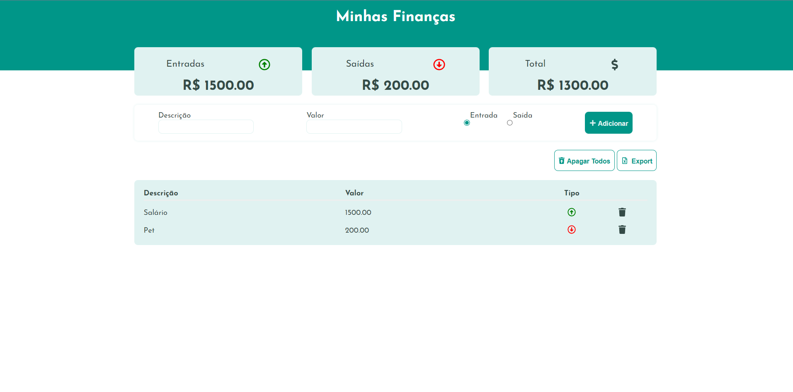

# 💹My Finances

Aplicativo para calcular entradas e saídas financeiras.

## 🚀 Instalação

Clone o projeto

```bash
  git clone https://github.com/quinamilena/my-finances.git
```

Entre no diretório do projeto

```bash
  cd my-finances
```

Instale as dependências

```bash
  bun install
```

Inicie o servidor de desenvolvimento

```bash
  bun run dev
```

Gere o build de produção

```bash
  bun run build
```

## 📷 Screenshots



## 💻 Demonstração

Digite a descrição, o valor e informe se é uma entrada ou saída.


## 👩‍💻 Stack utilizada

**Front-end:** React

## Licença

[MIT](https://choosealicense.com/licenses/mit/)
© 2022 GitHub, Inc.
Terms
Privacy
Security
Status
